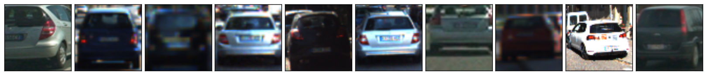
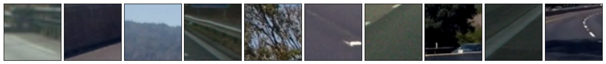
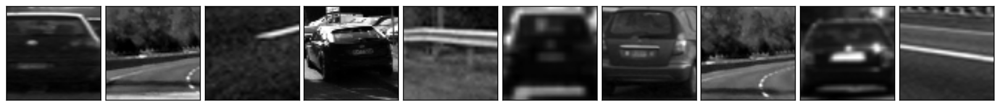
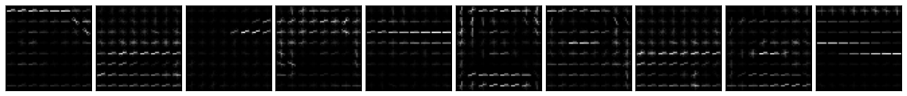
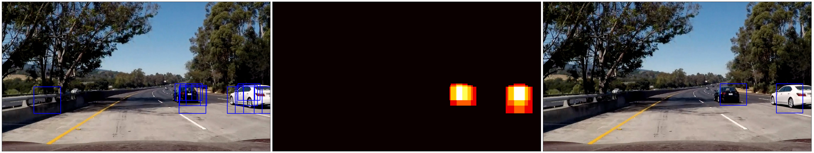

# Vehicle Tracking

## Project structure

| File                         | Description                                                                        |
| ---------------------------- | ---------------------------------------------------------------------------------- |
| `vehicletracker/features.py` | Implements feature extraction pipeline. |
| `vehicletracker/tracker.py`  | Implements surrounding vehicles tracking by applying a processing pipeline to consecutive frames in a video. |
| `vehicletracker/utility.py`  | Set of convenient logging routines. |

The goal of this project was to prepare a processing pipeline to identify surrounding vehicles in a video. We are going to break it down into the following steps:

* **Explore dataset.** Check out the dataset we are working with.
* **Extract features.** We need to identify features that would be useful for vehicle detections and prepare a feature extraction pipeline.
* **Train a classifier.** We need to train a classifier to detect a car in individual frame segment.
* **Apply frame segmentation.** Then we segment frame into _windows_ of various size that we run through the classifier.
* **Merge individual segment detections.** As there will inevitably be multiple detections we merge them together using a heat map, which should also help reducing the number of false positives.

## Dataset
In order to separate regions as containing cars and not containing cars, we are going to train a classifier using a dataset provided by Udacity. It contains **17,760** color RGB images **64×64 px** each, with **8,792** samples labeled as containing **vehicles** and **8,968** samples labeled as **non-vehicles**.

<p align="center">
  
  Random sample labeled as containing cars.
</p>

<p align="center">
  
  Random sample labeled as not containing cars.
</p>

## Feature extraction
After experimenting with various features I settled on a combination of **[HOG (Histogram of Oriented Gradients)](https://en.wikipedia.org/wiki/Histogram_of_oriented_gradients)**, **spatial information** and **color channel histograms**, all using **YCbCr** color space. Feature extraction is implemented as a `FeatureExtractor` class to allow some pre-calculations for each frame. As some features take a lot of time to compute (looking at you, HOG), we only do that once for entire image and then return regions of it. 

### Histogram of Oriented Gradients
I had to run a bunch of experiments to come up with final parameters, and eventually I settled on HOG with **10 orientations**, **8 pixels per cell** and **2 cells per block**. The experiments went as follows:

1. Train and evaluate the classifier for a wide range of parameters and identify promising smaller ranges.
2. Train and evaluate the classifier on those smaller ranges of parameters multiple times for each experiment and assess average accuracy.

The winning combination turned out to be the following:
```
 orient     px/cell    clls/blck  feat-s     iter       acc        sec/test  
 10         8          2          5880       0          0.982      0.01408   
 10         8          2          5880       1          0.9854     0.01405   
 10         8          2          5880       2          0.9834     0.01415   
 10         8          2          5880       3          0.9825     0.01412   
 10         8          2          5880       4          0.9834     0.01413   
Average accuracy = 0.98334
```

This is what Histogram of Oriented Gradients looks like applied to a random dataset sample.

<p align="center">
  
  Original (Y channel of YCbCr color space)
</p>

<p align="center">
  
  HOG (Histogram of Oriented Gradients)
</p>

Initial calculation of HOG for entire image is done using `hog()` function in `skimage.feature` module.

```python
(h, w, d) = image.shape
hog_features = []
for channel in range(d):
    hog_features.append(
        hog(
            image[:, :, channel], 
            orientations=10, 
            pixels_per_cell=(8, 8),
            cells_per_block=(2, 2), 
            transform_sqrt=True,
            visualise=False, 
            feature_vector=False
        )
    )
hog_features = np.asarray(hog_features)
```

This allows us to get features for individual image regions by calculating HOG array offsets, given that `x` is the image horizontal offset, `y` is the vertical offset and `k` is the size of the region (single value, side of a square).

```python
hog_k = (k // 8) - 1
hog_x = max((x // 8) - 1, 0)
hog_x = hog_features.shape[2] - hog_k if hog_x + hog_k > hog_features.shape[2] else hog_x
hog_y = max((y // 8) - 1, 0)
hog_y = hog_features.shape[1] - hog_k if hog_y + hog_k > hog_features.shape[1] else hog_y
region_hog = np.ravel(hog_features[:, hog_y:hog_y+hog_k, hog_x:hog_x+hog_k, :, :, :])
```

### Spatial information
For spatial information we simply resize the image to 16×16 and flatten to a 1-D vector.

```python
spatial = cv2.resize(image, (16, 16)).ravel()
```

### Color channel histogram
We additionally use individual color channel histogram information, breaking it into **16 bins** within **(0, 256) range**. 

```python
color_hist = np.concatenate((
    np.histogram(image[:, :, 0], bins=16, range=(0, 256))[0],
    np.histogram(image[:, :, 1], bins=16, range=(0, 256))[0],
    np.histogram(image[:, :, 2], bins=16, range=(0, 256))[0]
))
```

### `FeatureExtractor`
The way `FeatureExtractor` class works is that you initialise it with a single frame, and then request a feature vector for individual regions. In this case it only calculates computationally expensive features once. You then call `feature_vector()` method to get a concatenated combination of HOG, spatial and color histogram feature vectors.

```python
extractor = FeatureExtractor(frame)

# Feature vector for entire frame
feature_vector = extractor.feature_vector()

# Feature vector for a 64×64 frame region at (0, 0) point
feature_vector = extractor.feature_vector(0, 0, 64)
```

> For implementation details check `FeatureExtractor` class in `vehicletracker/features.py`.

## Training a classifier
I trained a Linear SVC (`sklearn` implementation), using feature extractor described above. Nothing fancy here, I used `sklearn`'s `train_test_split` to split the dataset into training and validation sets, and used `sklearn`'s `StandardScaler` for feature scaling. I didn't bother with a proper test set, as assumed that classifier performance on the project video would be a good proxy for a test set.

> For implementation details check `detecting-road-features.ipynb` notebook.

## Frame segmentation
I use a sliding window approach with a couple of additional constraints. For instance, we can approximate vehicle size we expect in different frame regions, which makes searching a bit easier.

<p align="center">
  
  Window size varies across scanning locations
</p>

Since frame segments must be of various size, and we eventually need to use 64×64 regions as a classifier input, I decided to simply scale the frame to various sizes and then scan them with a 64×64 window. This can be roughly encoded as follows.

```python
# Scan with 64×64 window across 8 differently scaled images, ranging from 30% to 80% of the original frame size. 
for (scale, y) in zip(np.linspace(.3, .8, 4), np.logspace(.6, .55, 4)):
    # Scale the original frame
    scaled = resize(image, (image.shape[0] * scale, image.shape[1] * scale, image.shape[2]))
    # Prepare a feature extractor
    extractor = FeatureExtractor(scaled)
    (h, w, d) = scaled.shape
    # Target stride is no more than 32 (half the size of the window), 
    # making sure windows are equally distributed along the frame width.
    for x in np.linspace(0, w - k, (w + 32) // 32):
        # Extract features for current window.
        features = extractor.feature_vector(x, h*y, 64)
        # Run features through a scaler and classifier and add window coordinates 
        # to `detections` if classified as containing a vehicle
        ...
```

> For implementation details check `VehicleTracker` class in `vehicletracker/tracker.py`.

## Merging segmented detections
As there are multiple detections on different scales and overlapping windows, we need to merge nearby detections. In order to do that we calculate a heatmap of intersecting regions that were classified as containing vehicles. 

```python
heatmap = np.zeros((image.shape[0], image.shape[1]))
# Add heat to each box in box list
for c in detections:
    # Assuming each set of coordinates takes the form (x1, y1, x2, y2)
    heatmap[c[1]:c[3], c[0]:c[2]] += 1
# Apply threshold to help remove false positives
heatmap[heatmap < threshold] = 0
```

Then we use `label()` function from `scipy.ndimage.measurements` module to detect individual groups of detections, and calculate a bounding rect for each of them.

```python
groups = label(heatmap)
detections = np.empty([0, 4])
# Iterate through all labeled groups
for group in range(1, groups[1] + 1):
    # Find pixels belonging to the same group
    nonzero = (groups[0] == group).nonzero()
    detections = np.append(
        detections,
        [[np.min(nonzero[1]), np.min(nonzero[0]), np.max(nonzero[1]), np.max(nonzero[0])]],
        axis=0
    )
```

<p align="center">
  
  Merging detections with a heat map
</p>

> For implementation details check `VehicleTracker` class in `vehicletracker/tracker.py`.

## Video
Working with video allowes us to use a couple of additional constraints, in a sense that we expect it to be a stream of consecutive frames. In order to eliminate false positives I accumulate detections over last N frames instead of classifying each frame individually. And before returning a final set of detected regions I run those accumulated detections through the heatmap merging process once again, but with a higher detection threshold.

```python
detections_history = deque(maxlen=15)

def process(frame):
    ...
    # Scan frame with windows through a classifier
    ...
    # Merge detections
    ...
    # Add merged detections to history
    detections_history.append(detections)

def heatmap_merge(detections, threshold):
    # Calculate heatmap for detections
    ...
    # Apply threshold
    ...
    # Merge detections with `label()` 
    ...
    # Calculate bounding rects
    ...

def detections():
    return heatmap_merge(
        np.concatenate(np.array(detections_history)),
        threshold=min(len(detections_history), 5)
    )

```

This approach proved iself to work reasonably well, you can check out the [full video here](https://github.com/navoshta/advanced-lane-finding/blob/master/project_video_annotated.mp4).

<p align="center">
  
</p>

> For implementation details check `VehicleTracker` class in `vehicletracker/tracker.py`.

## Results
This clearly is a very naive way of detecting surrounding vehicles, as it is likely to fail in too many scenarios:

* Vehicles obstructing each other.
* Changing weather conditions.
* Vehicles and vehicle positions different from those classifier was trained on.
* ...

Not to mention it is painfully slow and wouldn't run in real time without substantial optimisations. Nevertheless this project is a good representation of what can be done in terms of feature extraction, and how we could use those features as part of more sophisticated algorithms.


