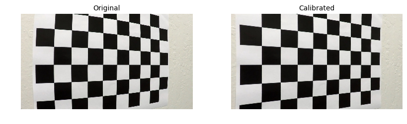
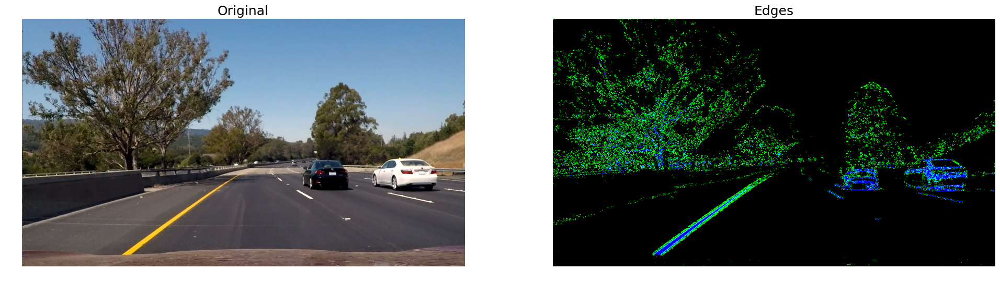
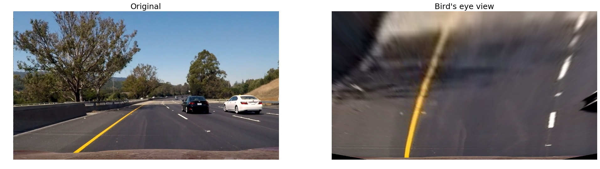
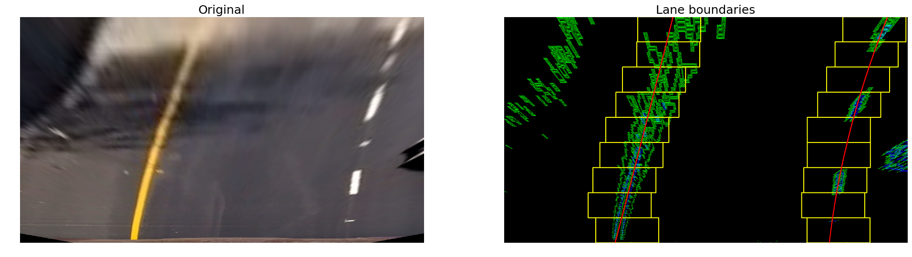
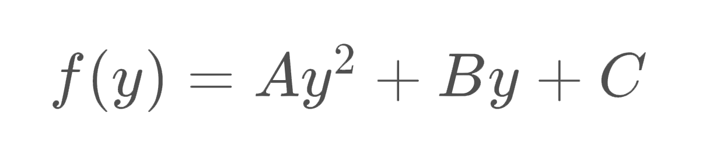
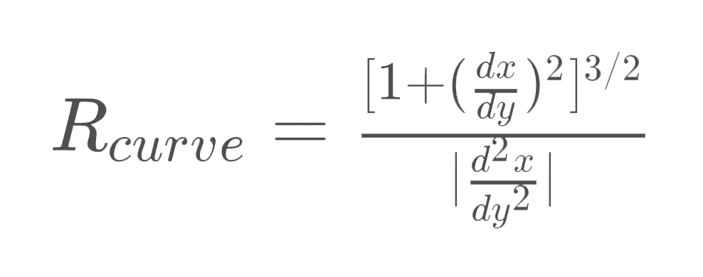
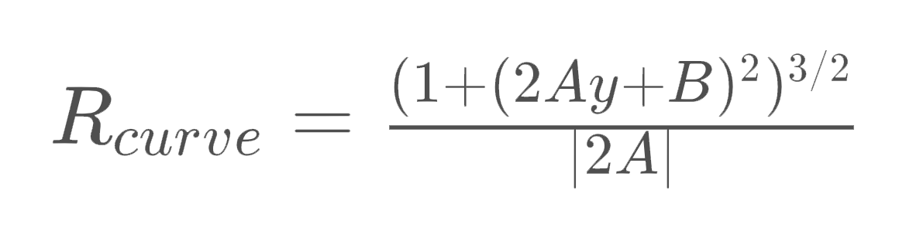

# Advanced Lane Finding

## Project structure

| File                         | Description                                                                        |
| ---------------------------- | ---------------------------------------------------------------------------------- |
| `lanetracker/camera.py`      | Implements camera calibration based on the set of calibration images. |
| `lanetracker/tracker.py`     | Implements lane tracking by applying a processing pipeline to consecutive frames in a video. |
| `lanetracker/gradients.py`   | Set of edge-detecting routines based on gradients and color. |
| `lanetracker/perspective.py` | Set of perspective transformation routines. |
| `lanetracker/line.py` 	   | `Line` class representing a single lane boundary line. |
| `lanetracker/window.py`      | `Window` class representing a scanning window used to detect points likely to represent lines. |

The goal of this project was to prepare a processing pipeline to identify the lane boundaries in a video. The pipeline includes the following steps that we apply to each frame:
* **Camera calibration.** To cater for inevitable camera distortions, we calculate camera calibration using a set of calibration chessboard images, and applying correction to each of the frames.
* **Edge detection with gradient and color thresholds.** We then use a bunch of metrics based on gradients and color information to highlight edges in the frame.
* **Perspective transformation.** To make lane boundaries extraction easier we apply a perspective transformation, resulting in something similar to a bird's eye view of the road ahead of the vehicle.
* **Fitting boundary lines.** We then scan resulting frame for pixels that could belong to lane boundaries and try to approximate lines into those pixels.
* **Approximate road properties and vehicle position.** We also provide a rough estimate on road curvature and vehicle position within the lane using known road dimensions.

## Camera calibration
We are going to use a set of OpenCV routines in order to apply correction for camera distortion. I first prepare a `pattern` variable holding _object points_ in `(x, y, z)` coordinate space of the chessboard, where `x` and `y` are horizontal and vertical indices of the chessboard squares, and `z` is always `0`. Those _object points_ are going to be the same for each calibration image, as we expect the same chessboard in each. 

```python
pattern = np.zeros((pattern_size[1] * pattern_size[0], 3), np.float32)
pattern[:, :2] = np.mgrid[0:pattern_size[0], 0:pattern_size[1]].T.reshape(-1, 2)
```

We then use `cv2.findChessboardCorners()` function to get coordinates of the corresponding corners in each calibration image.

```python
pattern_points = []
image_points = []
found, corners = cv2.findChessboardCorners(image, (9, 6), None)
if found:
    pattern_points.append(pattern)
    image_points.append(corners)
```

Once we have collected all the points from each image, we can compute the camera calibration matrix and distortion coefficients using the `cv2.calibrateCamera()` function.

```python
_, self.camera_matrix, self.dist_coefficients, _, _ = cv2.calibrateCamera(
    pattern_points, image_points, (image.shape[1], image.shape[0]), None, None
)
```

Now that we have camera calibration matrix and distortion coefficients we can use `cv2.undistort()` to apply camera distortion correction to any image.

```python
corrected_image = cv2.undistort(image, self.camera_matrix, self.dist_coefficients, None, self.camera_matrix)
```

As some of the calibration images did not have chessboard fully visible, we will use one of those for verifying aforementioned calibration pipeline.

<p align="center">
  
</p>

> For implementation details check `CameraCalibration` class in `lanetracker/camera.py`.

## Edge detection
We use a set of gradient and color based thresholds to detect edges in the frame.

### Gradient absolute value
For absolute gradient value we simply apply a threshold to `cv2.Sobel()` output for each axis.

```python
sobel = np.absolute(cv2.Sobel(image, cv2.CV_64F, 1, 0, ksize=3))
```

### Gradient magnitude
Additionaly we include pixels within a threshold of the gradient magnitude.

```python
sobel_x = cv2.Sobel(image, cv2.CV_64F, 1, 0, ksize=3)
sobel_y = cv2.Sobel(image, cv2.CV_64F, 0, 1, ksize=3)
magnitude = np.sqrt(sobel_x ** 2 + sobel_y ** 2)
```

### Gradient direction
We also include pixels that happen to be withing a threshold of the gradient direction.

```python
sobel_x = cv2.Sobel(image, cv2.CV_64F, 1, 0, ksize=3)
sobel_y = cv2.Sobel(image, cv2.CV_64F, 0, 1, ksize=3)
direction = np.arctan2(np.absolute(sobel_y), np.absolute(sobel_x))
```

### Color
Finally, we extract S channel of image representation in the HLS color space and then apply a threshold on its absolute value.

```python
hls = cv2.cvtColor(np.copy(image), cv2.COLOR_RGB2HLS).astype(np.float)
s_channel = hls[:, :, 2]
```

We apply a combination of all these filters as an edge detection pipeline. Here is an example of its output, where pixels masked by color are blue, and pixels masked by gradient are green.

<p align="center">
  
</p>

> For implementation details check functions in `lanetracker/gradients.py`.

## Perspective tranform
I manually pin-pointed source and destination points in the camera frames, so perspective transform simply maps the following coordinates.

| Source | Destination |
| ------ | ----------- |
| `(564, 450)` | `(100, 0)` |
| `(716, 450)` | `(1180, 0)` |
| `(-100, 720)` | `(100, 720)` |
| `(1380, 720)` | `(1180, 720)` |

The transformation is applied using `cv2.getPerspectiveTransform()` function.

```python
(h, w) = (image.shape[0], image.shape[1])
source = np.float32([[w // 2 - 76, h * .625], [w // 2 + 76, h * .625], [-100, h], [w + 100, h]])
destination = np.float32([[100, 0], [w - 100, 0], [100, h], [w - 100, h]])
transform_matrix = cv2.getPerspectiveTransform(source, destination)
image = cv2.warpPerspective(image, transform_matrix, (w, h))
```

This is what it looks like for an arbitrary test image.

<p align="center">
  
</p>

> For implementation details check functions in `lanetracker/perspective.py`.

## Approximate boundaries
We then scan the resulting frame from bottom to top trying to isolate pixels that could be representing lane boundaries. What we are trying to detect is two lines (each represented by `Line` class) that would make up lane boundaries. For each of those lines we have a set of _windows_ (represented by `Window` class). We scan the frame with those windows, collecting non-zero pixels within window bounds. Once we reach the top, we try to fit a second order polynomial into collected points. This polynomial coefficients would represent a single lane boundary.

Here is a debug image representing the process. On the left is the _original_ image after we apply camera calibration and perspective transform. On the right is the same image, but with edges highlighted in green and blue, scanning windows boundaries highlighted in yellow, and a second order polynomial approximation of collected points in red.

<p align="center">
  
</p>

> For implementation details check `LaneTracker` class in `lanetracker/tracker.py`, `Window` class in `lanetracker/window.py` and `Line` class in `lanetracker/line.py`.

## Approximate properties
We can now approximate some of the road properties and vehicle spacial position using known real world dimensions. Here we assume that the visible vertical part of the bird's eye view warped frame is **27 meters**, based on the known length of the dashed lines on american roads. We also assume that lane width is around **3.7 meters**, again, based on american regulations.

```python
ym_per_pix = 27 / 720  # meters per pixel in y dimension
xm_per_pix = 3.7 / 700  # meters per pixel in x dimension
```

### Road curvature
Previously we approximated each lane boundary as a second order polynomial curve, which can be represented with the following equation.

<p align="center">
  
</p>

As per [this tutorial](http://www.intmath.com/applications-differentiation/8-radius-curvature.php), we can get the radius of curvature in an arbitrary point using the following equation.

<p align="center">
  
</p>

If we calculate actual derivatives of the second order polynomial, we get the following.

<p align="center">
  
</p>

Therefore, given `x` and `y` variables contain coordinates of points making up the curve, we can get curvature radius as follows.

```python
# Fit a new polynomial in real world coordinate space
poly_coef = np.polyfit(y * ym_per_pix, x * xm_per_pix, 2)
radius = ((1 + (2 * poly_coef[0] * 720 * ym_per_pix + poly_coef[1]) ** 2) ** 1.5) / np.absolute(2 * poly_coef[0])
```

### Vehicle position
We can also approximate vehicle position within the lane. This rountine would calculate an approximate distance to a curve at the bottom of the frame, given that `x` and `y` contain coordinates of points making up the curve.

```python
(h, w, _) = frame.shape
distance = np.absolute((w // 2 - x[np.max(y)]) * xm_per_pix)
```

> For implementation details check `Line` class in `lanetracker/line.py`.

## Video

We can now try to apply the whole pipeline to a sequence of frames. We will use an approximation of lane boundaries detected over last 5 frames in the video using a `deque` collection type. It will make sure we only store last 5 boundary approximations.

```python
from collections import deque

coefficients = deque(maxlen=5)
```

We then check if we detected enough points (`x` and `y` arrays of coordinates) in the current frame to approximate a line, and append polynomial coefficients to `coefficients`. The sanity check here is to ensure detected points span over image height, otherwise we wouldn't be able to get a reasonable line approximation.

```python
if np.max(y) - np.min(y) > h * .625:
	coefficients.append(np.polyfit(y, x, 2))
```

Whenever we want to draw the line, we get an average of polynomial coefficients, detected over last 5 frames.

```python
mean_coefficients = np.array(coefficients).mean(axis=0)
```

This approach proved iself to work reasonably well, you can check out the [full video here](https://github.com/navoshta/advanced-lane-finding/blob/master/data/video/project_video_annotated_lane.mp4).

<p align="center">
  
</p>

> For implementation details check `LaneTracker` class in `lanetracker/tracker.py`.

## Results
This clearly is a very naive way of detecting and tracking the lane, as it is likely to fail in too many scenarios:

* Going up or down the hill.
* Changing weather conditions.
* Worn out lane markings.
* Obstruction by other vehicles.
* ...

Nevertheless this project is a good representation of what can be done by simply inspecting pixel values' gradients and color spaces. It shows that even with these limited tools we can extract a lot of useful information from an image, and that this information can potentially be used as an input to more sophisticated algorithms.


